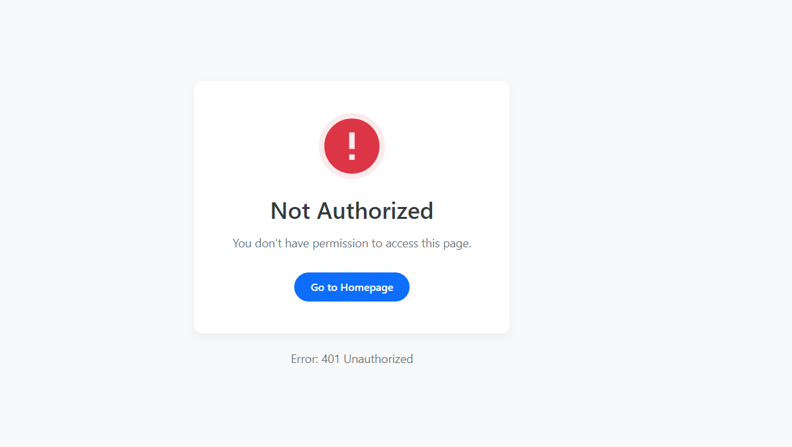

# Product Management Spring Application

## Overview

This is a Spring Boot web application designed for managing a catalog of products. It incorporates user authentication and role-based authorization, providing distinct functionalities for regular users and administrators. Users can view and search for products, while administrators have extended permissions to add, edit, and delete products. The application also features a REST API endpoint for listing products.

**Key Features:**
*   User Authentication (Login/Logout) using Spring Security.
*   Role-based Authorization (USER, ADMIN).
*   CRUD operations for Products (Create, Read, Update, Delete) - CUD operations are admin-restricted.
*   Product Search Functionality (case-insensitive by name).
*   Responsive User Interface built with Bootstrap and Thymeleaf.
*   Data persistence using Spring Data JPA with a MySQL database.
*   Initial data seeding for products and users.

## Technology Stack

*   **Backend:** Java 17+, Spring Boot 3.x
*   **Security:** Spring Security
*   **Data Access:** Spring Data JPA, Hibernate
*   **Database:** MySQL
*   **Templating:** Thymeleaf
*   **Frontend:** Bootstrap 5, HTML, CSS, JavaScript
*   **Build Tool:** Apache Maven

## Project Structure

```
./
└── src
├── main
│   ├── java
│   │   └── ma
│   │       └── enset
│   │           └── productmangmentspring
│   │               ├── entities
│   │               │   ├── AppUser.java      // User entity
│   │               │   └── Product.java      // Product entity with validations
│   │               ├── repo
│   │               │   ├── ProductRepository.java // JPA repository for Products
│   │               │   └── UserRepository.java    // JPA repository for AppUsers
│   │               ├── sec
│   │               │   ├── CostumerDetailsService.java // Custom UserDetailsService
│   │               │   └── SecurityConfig.java       // Spring Security configuration
│   │               ├── web
│   │               │   └── ProductController.java    // Handles web requests
│   │               └── ProductMangmentSpringApplication.java // Main application class with CommandLineRunner
│   └── resources
│       ├── templates
│       │   ├── add-product.html  // Form for adding/editing products
│       │   ├── layout.html       // Main layout template
│       │   ├── login.html        // Custom login page
│       │   ├── notAuthorized.html// Access denied page
│       │   └── products.html     // Page to display/search products
│       └── application.properties // Application configuration
└── test
└── java
└── ma
└── enset
└── productmangmentspring
└── ProductMangmentSpringApplicationTests.java
```

## How the App Works

### Authentication and Authorization

*   The application employs Spring Security to manage user authentication and authorization.
*   Users must log in via a custom login page (`/login`) to access protected resources.
*   User details (username, encoded password, roles) are stored in the database and loaded by `CostumerDetailsService`.
*   Two primary roles are defined:
    *   **`ROLE_USER`**: Can view the product list (`/user/index`) and search for products (`/user/search`).
    *   **`ROLE_ADMIN`**: Possesses all `USER` permissions and can additionally:
        *   Access the form to add new products (`/admin/newProduct`).
        *   Save new or updated products (`/admin/saveProduct`).
        *   Access the form to edit existing products (`/admin/products/edit/{id}`).
        *   Delete products (`/admin/deleteProduct`).
*   If a user attempts to access a resource they are not authorized for, they are redirected to the `/notAuthorized` page.
*   Logout functionality is available, invalidating the user's session.

### Product Management

*   **View Products**: All authenticated users can view a paginated list of products.
*   **Search Products**: Users can search for products by name. The search is case-insensitive and matches partial names.
*   **Add Product (Admin only)**: Administrators can add new products by providing a name, price, and quantity. Input fields have server-side and basic client-side validation.
*   **Edit Product (Admin only)**: Administrators can modify the details of existing products. The "add product" form is reused, pre-filled with the data of the product being edited.
*   **Delete Product (Admin only)**: Administrators can remove products from the system. A confirmation dialog is shown before deletion.

## Code Snippets Explained

### 1. `SecurityConfig.java` - Security Configuration

This class is central to defining the application's security rules, login behavior, and access control.

```java
// src/main/java/ma/enset/productmangmentspring/sec/SecurityConfig.java
package ma.enset.productmangmentspring.sec;

// ... imports ...

@Configuration
@EnableWebSecurity
@EnableGlobalMethodSecurity(prePostEnabled = true) // Enables method-level security if needed
public class SecurityConfig {

    @Bean
    public PasswordEncoder passwordEncoder(){
        // Uses BCrypt for strong password hashing
        return new BCryptPasswordEncoder();
    }

    @Bean
    public SecurityFilterChain securityFilterChain(HttpSecurity http) throws Exception {
        return http
                // Configures form-based login
                .formLogin(fl -> fl.loginPage("/login").permitAll()) // Custom login page, accessible by all
                .csrf(Customizer.withDefaults()) // Enables CSRF protection with default settings
                // Defines authorization rules for HTTP requests
                .authorizeHttpRequests(ar -> ar
                        .requestMatchers("/user/**").hasRole("USER") // URLs under /user/ require USER role
                        .requestMatchers("/admin/**").hasRole("ADMIN") // URLs under /admin/ require ADMIN role
                        .requestMatchers("/public/**", "/webjars/**").permitAll() // Publicly accessible paths
                        .anyRequest().authenticated() // All other requests require authentication
                )
                // Configures exception handling for access denied errors
                .exceptionHandling(eh -> eh.accessDeniedPage("/notAuthorized"))
                .build();
    }
}
```
*   **`passwordEncoder()`**: Provides a `BCryptPasswordEncoder` bean for hashing user passwords, enhancing security.
*   **`securityFilterChain(HttpSecurity http)`**:
    *   Configures a custom login page at `/login`.
    *   Defines URL patterns and associated roles: `/user/**` for `USER`s, `/admin/**` for `ADMIN`s.
    *   Static resources like `/webjars/**` are permitted for all.
    *   Any other request requires the user to be authenticated.
    *   Redirects to `/notAuthorized` if access is denied.

### 2. `ProductController.java` - Handling Web Requests

This controller manages HTTP requests related to product operations and navigation.

```java
// src/main/java/ma/enset/productmangmentspring/web/ProductController.java
package ma.enset.productmangmentspring.web;

// ... imports ...

@Controller
public class ProductController {

    private final ProductRepository productRepository;

    public ProductController(ProductRepository productRepository) {
        this.productRepository = productRepository;
    }

    @GetMapping("/user/index") // Mapped to USER role in SecurityConfig
    public String products(Model model) {
        List<Product> products = productRepository.findAll();
        model.addAttribute("products", products);
        return "products"; // Renders products.html
    }

    @GetMapping("/admin/newProduct") // Mapped to ADMIN role
    public String addProductForm(Model model) {
        model.addAttribute("product", new Product());
        return "add-product"; // Renders add-product.html
    }

    @PostMapping("/admin/saveProduct") // Mapped to ADMIN role
    public String saveProduct(@Valid @ModelAttribute("product") Product product, BindingResult bindingResult) {
        if (bindingResult.hasErrors()) {
            return "add-product"; // If validation errors, show form again
        }
        productRepository.save(product);
        return "redirect:/admin/newProduct"; // Redirect to clear form or show success
    }

    @PostMapping("/admin/deleteProduct") // Mapped to ADMIN role
    public String deleteProduct(@RequestParam(name = "id") Long id) {
        productRepository.deleteById(id);
        return "redirect:/user/index"; // Redirect to product list
    }

    // ... other mappings like /login, /logout, /api/products ...
}
```
*   **`@GetMapping("/user/index")`**: Fetches all products and displays them on the `products.html` page.
*   **`@GetMapping("/admin/newProduct")`**: Displays the form (`add-product.html`) for creating a new product.
*   **`@PostMapping("/admin/saveProduct")`**: Handles the submission of the new/edit product form. It uses `@Valid` to trigger validation based on annotations in the `Product` entity. If errors occur, it re-displays the form; otherwise, it saves the product.
*   **`@PostMapping("/admin/deleteProduct")`**: Deletes a product based on its ID.

### 3. `CostumerDetailsService.java` - Custom User Authentication

This service implements Spring Security's `UserDetailsService` to load user-specific data from the database.

```java
// src/main/java/ma/enset/productmangmentspring/sec/CostumerDetailsService.java
package ma.enset.productmangmentspring.sec;

// ... imports ...

@Service
public class CostumerDetailsService implements UserDetailsService {

    private final UserRepository userRepository;

    public CostumerDetailsService(UserRepository userRepository) {
        this.userRepository = userRepository;
    }

    @Override
    public UserDetails loadUserByUsername(String username) throws UsernameNotFoundException {
        AppUser appUser = userRepository.findByUsername(username); // Fetches user from DB
        if (appUser == null) {
            throw new UsernameNotFoundException("User not found with username: " + username);
        }
        // Creates a Spring Security User object
        return User.withUsername(appUser.getUsername())
                .password(appUser.getPassword()) // Password must be encoded in DB
                .roles(appUser.getRoles().toArray(new String[0])) // Converts List<String> to String[]
                .build();
    }
}
```
*   **`loadUserByUsername(String username)`**: This method is called by Spring Security during the authentication process. It retrieves the `AppUser` from the database using `UserRepository`. If found, it constructs a `UserDetails` object (specifically `org.springframework.security.core.userdetails.User`) containing the username, encoded password, and roles.

### 4. `ProductMangmentSpringApplication.java` - Initial Data Seeding

The `CommandLineRunner` bean is used to insert initial data (sample products and users) into the database when the application starts.

```java
// src/main/java/ma/enset/productmangmentspring/ProductMangmentSpringApplication.java
package ma.enset.productmangmentspring;

// ... imports ...

@SpringBootApplication
public class ProductMangmentSpringApplication {

    public static void main(String[] args) {
        SpringApplication.run(ProductMangmentSpringApplication.class, args);
    }

    @Bean
    public CommandLineRunner start(ProductRepository productRepository, UserRepository userRepository, PasswordEncoder passwordEncoder) {
        return args -> {
            // Create and save sample products
            productRepository.save(Product.builder().name("Laptop Pro X").price(1200.99).quantity(15).build());
            productRepository.save(Product.builder().name("Smartphone Galaxy").price(799.50).quantity(25).build());
            productRepository.save(Product.builder().name("Wireless Headphones").price(149.00).quantity(50).build());

            // Create and save sample users with encoded passwords
            userRepository.save(AppUser.builder()
                    .username("admin")
                    .password(passwordEncoder.encode("1234")) // Password "1234" encoded
                    .roles(Arrays.asList("ADMIN", "USER"))
                    .build());
            userRepository.save(AppUser.builder()
                    .username("user1")
                    .password(passwordEncoder.encode("1234")) // Password "1234" encoded
                    .roles(List.of("USER"))
                    .build());
        };
    }
}
```
*   This `CommandLineRunner` ensures that the application has some usable data and user accounts upon first run, which is helpful for development and demonstration. Passwords are encoded using the `PasswordEncoder` bean.

### 5. `Product.java` - Entity with Validation

The `Product` entity defines the structure of a product and includes validation constraints.

```java
// src/main/java/ma/enset/productmangmentspring/entities/Product.java
package ma.enset.productmangmentspring.entities;

// ... imports ...
import jakarta.validation.constraints.Min;
import jakarta.validation.constraints.NotEmpty;
import jakarta.validation.constraints.Size;

@Entity
@NoArgsConstructor @AllArgsConstructor @Builder @Setter @Getter @ToString
public class Product {
    @Id @GeneratedValue(strategy = GenerationType.IDENTITY)
    private Long id;

    @NotEmpty(message = "Product name cannot be empty")
    @Size(min = 4, max = 20, message = "Name must be between 4 and 20 characters")
    private String name;

    @Min(value = 0, message = "Price cannot be negative")
    private double price;

    @Min(value = 0, message = "Quantity cannot be negative")
    private int quantity;
}
```
*   JPA annotations (`@Entity`, `@Id`, `@GeneratedValue`) map this class to a database table.
*   Lombok annotations (`@Data`, `@NoArgsConstructor`, etc.) reduce boilerplate code.
*   Jakarta Bean Validation annotations (`@NotEmpty`, `@Size`, `@Min`) are used by Spring MVC (when `@Valid` is present in the controller) to validate product data automatically.

### 6. `ProductRepository.java` - Data Access Layer

This interface extends `JpaRepository` for basic CRUD operations and defines a custom query method.

```java
// src/main/java/ma/enset/productmangmentspring/repo/ProductRepository.java
package ma.enset.productmangmentspring.repo;

import ma.enset.productmangmentspring.entities.Product;
import org.springframework.data.jpa.repository.JpaRepository;
import java.util.List;

public interface ProductRepository extends JpaRepository<Product, Long> {
    // Custom query method: Spring Data JPA derives the query from the method name.
    // Finds products where the name contains the given string, ignoring case.
    List<Product> findProductByNameContainingIgnoreCase(String name);
}
```
*   `JpaRepository<Product, Long>` provides methods like `findAll()`, `findById()`, `save()`, `deleteById()`.
*   `findProductByNameContainingIgnoreCase(String name)` is a custom method. Spring Data JPA automatically generates the SQL query for this method based on its name, enabling easy implementation of search functionality.

## Setup and Run

1.  **Prerequisites:**
    *   Java JDK 17 or newer
    *   Apache Maven 3.6+
    *   MySQL Server (or another compatible SQL database)

2.  **Database Configuration:**
    *   Ensure your MySQL server is running.
    *   The application will attempt to create the database `product_management` if it doesn't exist (due to `createDatabaseIfNotExist=true` in the connection URL).
    *   Modify `src/main/resources/application.properties` with your MySQL credentials:
        ```properties
        spring.datasource.url=jdbc:mysql://localhost:3306/product_management?createDatabaseIfNotExist=true
        spring.datasource.username=your_mysql_username
        spring.datasource.password=your_mysql_password
        spring.datasource.driver-class-name=com.mysql.cj.jdbc.Driver
        spring.jpa.hibernate.ddl-auto=update
        spring.jpa.properties.hibernate.dialect=org.hibernate.dialect.MySQL8Dialect
        # ... other properties
        ```


3. **Default Users (credentials from `CommandLineRunner`):**
   *   **Admin:** Username: `admin`, Password: `1234`
   *   **User:** Username: `user1`, Password: `1234`

## Application Demo (Screenshots)

Below are placeholders for screenshots demonstrating the application's key screens and features.

1.  **Login Page**
    *   The entry point for users to authenticate.
        
    *   *Description: Users enter their username and password to access the application. The page has a clean and modern design.*

2.  **Product List Page (User/Admin View)**
    *   Displays all available products. Admins will see additional action buttons (Edit/Delete).
        
    *   *Description: A table lists products with details like ID, Name, Price, and Quantity. A search bar is present at the top. For admin users, "Edit" and "Delete" buttons are visible for each product.*

3.  **Product Search Results**
    *   Shows the product list filtered by the entered search term.
        
    *   *Description: The product table dynamically updates to show only products matching the search query entered in the search bar.*

4.  **Add New Product Page (Admin View)**
    *   The form used by administrators to add new products to the system.
        
    *   *Description: Administrators can fill in the name, price, and quantity for a new product. Validation messages will appear if input rules are violated (e.g., empty name, negative price).*

5.  **Edit Product Page (Admin View)**
    *   The form used by administrators to modify details of an existing product.
        
    *   *Description: Similar to the "Add Product" page, but the fields are pre-populated with the selected product's current data, allowing for easy modification and saving.*

6.  **"Not Authorized" Page**
    *   This page is shown when a user tries to access a resource without the required permissions.
        
    *   *Description: A user-friendly error page indicating that access to the requested resource is denied due to insufficient permissions, with a link to navigate back to a safe page (e.g., homepage).*
